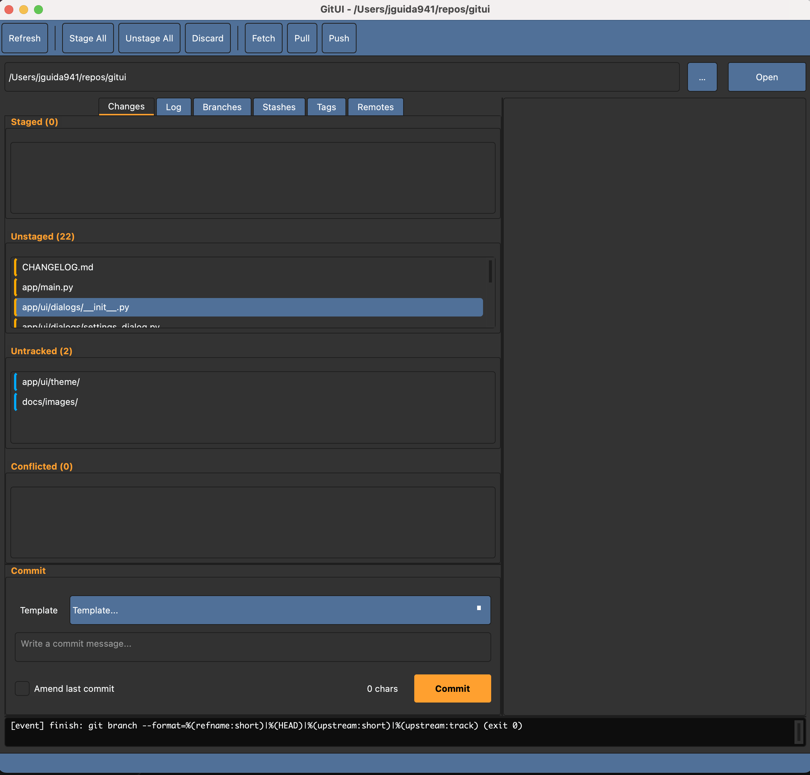

# GitUI

A PySide6 desktop UI on top of the git CLI. The backend stays CLI-native for full parity; the UI is a thin, themeable dashboard.

## Quick start

- Install deps: `pip install .[dev]`
- Run tests: `pytest -q`
- Launch UI: `python -m app.main --repo /path/to/repo`
  - Alternate launcher: `python scripts/run_gitui.py --repo /path/to/repo`

## Features

Implemented
- CLI-native backend (CommandRunner + GitRunner + GitService) with machine-readable parsing.
- CommandQueue + RepoController/RepoState wiring with live console output.
- Repo picker + status/diff workflow (staged/unstaged/untracked/conflicted lists).
- Commit + fetch/pull/push actions.
- Branch/log/stash/tag/remote panels with wired actions (switch/create/delete, remote branch list/delete, stash save/apply/pop/drop, tag create/delete/push, remote add/remove/set-url).
- Theme engine + editor (presets, undo/redo, live preview, JSON/QSS import/export).

Planned
- Commit details view + per-commit diffs/compare tools.
- Insights/graphs (activity, churn, contributors, commit DAG).
- Conflict center + merge/rebase/cherry-pick flows.
- Partial staging (hunks/lines).
- Power tools (blame, grep, file history, show, diff summaries).
- Optional GitHub CLI integration (ADR-gated).

Status: active development.
