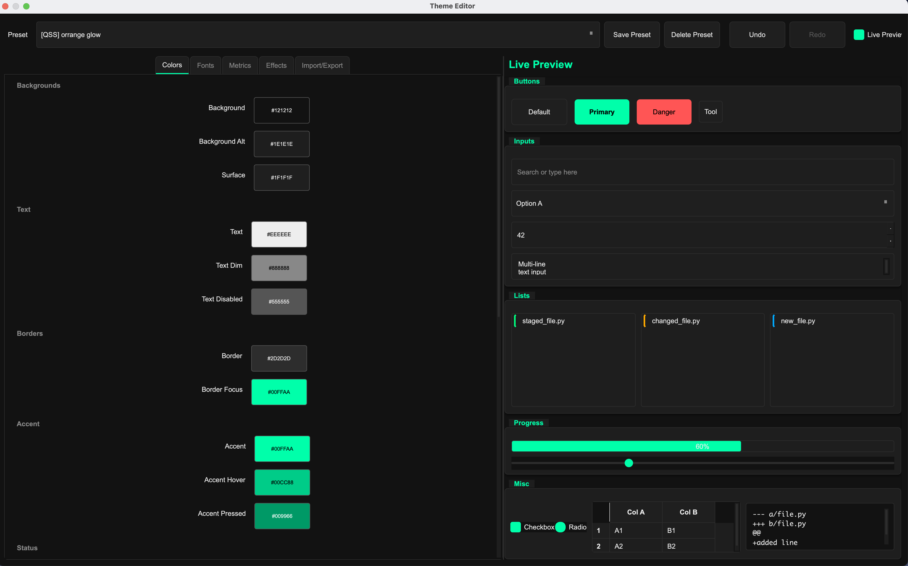

# GitUI

A PySide6 desktop UI on top of the git CLI. The backend stays CLI-native for full parity; the UI is a thin, themeable dashboard.


## Features

**Implemented**
- CLI-native backend (CommandRunner + GitRunner + GitService) with machine-readable parsing
- CommandQueue + RepoController/RepoState wiring with live console output
- Repo picker + status/diff workflow (staged/unstaged/untracked/conflicted lists)
- Commit + fetch/pull/push actions
- Branch/log/stash/tag/remote panels with wired actions (switch/create/delete, remote branch list/delete, stash save/apply/pop/drop, tag create/delete/push, remote add/remove/set-url)
- Theme engine + editor (presets, undo/redo, live preview, JSON/QSS import/export)

**Planned**
- Commit details view + per-commit diffs/compare tools
- Insights/graphs (activity, churn, contributors, commit DAG)
- Conflict center + merge/rebase/cherry-pick flows
- Partial staging (hunks/lines)
- Power tools (blame, grep, file history, show, diff summaries)
- Optional GitHub CLI integration (ADR-gated)

## Theme Editor

Customize the entire look and feel of GitUI without editing any code.



**Capabilities:**
- **Presets** - Choose from built-in themes or save your own custom presets
- **Live Preview** - See changes instantly in the preview panel as you edit
- **Undo/Redo** - Experiment freely with full history support
- **Colors** - Customize backgrounds, text, borders, accents, status indicators, and diff highlighting (20+ color options organized by category)
- **Fonts** - Select UI and monospace font families with configurable sizes for base text, headings, and more
- **Metrics** - Adjust border radius, padding, spacing, scrollbar width, button dimensions, and other layout values
- **Effects** - Configure drop shadows, transition animations, and hover effects
- **Import/Export** - Load themes from JSON files, paste JSON or QSS directly, and export your themes as JSON or Qt stylesheets (QSS)

## Install

See `INSTALL.md` for Windows (PowerShell/CMD), macOS, and Homebrew instructions.

## Dev Quick Start

```bash
# Install dependencies
pip install .[dev]

# Run tests
pytest -q

# Launch UI
python -m app.main --repo /path/to/repo

# Alternate launcher
python scripts/run_gitui.py --repo /path/to/repo
```

---

Status: active development
